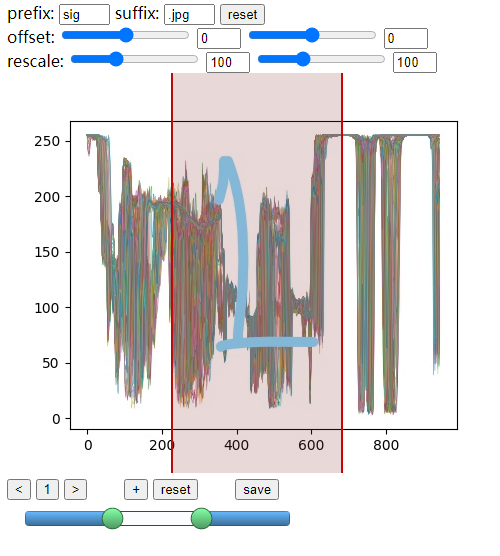

# SignalAnnotation (HTML ver)

#### 默认视图

#### 使用方法

将所有待标注数据以图片方式保存，修改prefix和suffix找到图片所在位置，修改图片大小和位置使得横坐标轴的上下限贴着画布边缘（注意不是方框贴合，以图中为例是0和900）。

开始标注

所有的数据和设置存在localStorage中，浏览器关闭后数据也不会丢失(大概)，最后点击save手动下载下来，得到json格式数据

#### 基本操作

- < 
  - 向前翻页 (id--)，快捷键左箭头

- 1 
  - 点击跳页 (id = num)
- \>
  - 往后翻页 (id++)，快捷键右箭头
- \+ 
  - 添加slider
- reset
  - 重置slider为默认 (一条)
- save
  - 下载所有标注信息为data.json文件
  - 格式为`{"1":[[33,67]],"2":[["33","67"],["33","67"]]}`

#### 改变设置

- prefix 和 suffix 用来修改路径，图片路径为prefix + id + suffix
  - 例：{prefix: "sig", suffix: ".jpg", id: 1} => path: "sig1.jpg"
- offset 修改图片在画布中的位置
- rescale 修改图片大小

